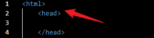
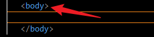

# DevOpsTraining
It was fun learning documentation and cloning of github repository.

## Head
This is an important in html tag. This doesn't include the content of the html page

## Body
This contains the body of the html page. This includes ``tags`` such as
- div
- section

